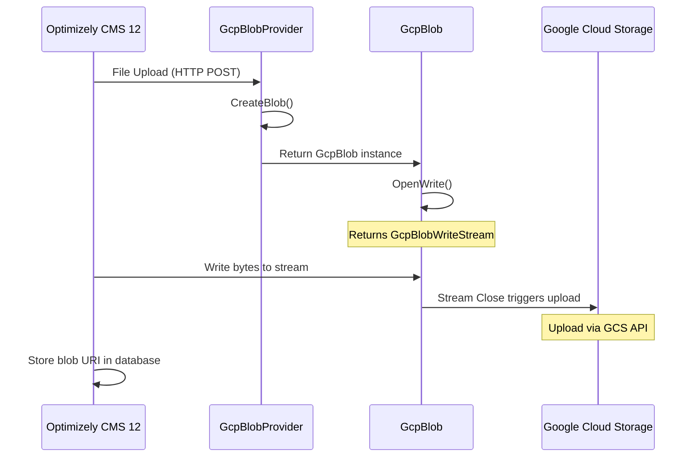
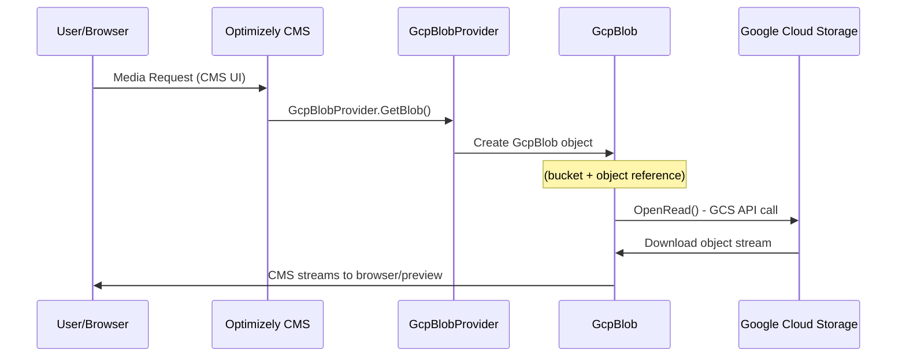

# Optimizely CMS 12 - Google Cloud Storage Integration Flow

## Architecture Components

```
┌─────────────────┐    ┌──────────────────┐    ┌─────────────┐    ┌──────────────────┐
│   Optimizely    │    │  GcpBlobProvider │    │   GcpBlob   │    │ Google Cloud     │
│     CMS 12      │    │                  │    │             │    │    Storage       │
└─────────────────┘    └──────────────────┘    └─────────────┘    └──────────────────┘
```

## Upload Flow



### Step-by-Step Upload Process

1. **File Upload Initiation**
   ```
   ┌────────────────────────────┐
   │   File Upload in CMS UI    │
   └─────────────┬──────────────┘
                 │ HTTP POST
                 ▼
   ```

2. **Blob Creation**
   ```
   ┌────────────────────────────┐
   │ GcpBlobProvider.CreateBlob │
   └─────────────┬──────────────┘
                 │
                 ▼
   ```

3. **GcpBlob Instance**
   ```
   ┌──────────────────────┐
   │   Return GcpBlob     │
   └──────────┬───────────┘
              │
              ▼
   ```

4. **Write Stream Creation**
   ```
   ┌────────────────────────────┐
   │ GcpBlob.OpenWrite()        │
   │ → returns GcpBlobWriteStream│
   └─────────────┬──────────────┘
                 │
                 ▼
   ```

5. **Data Writing**
   ```
   ┌──────────────────────────┐
   │ CMS writes bytes to      │
   │ GcpBlobWriteStream       │
   └─────────────┬────────────┘
                 │
                 ▼
   ```

6. **Upload to GCS**
   ```
   ┌────────────────────────────┐
   │ Stream Close triggers      │
   │ Upload to GCS via API      │
   └─────────────┬──────────────┘
                 │
                 ▼
   ```

7. **Database Storage**
   ```
   ┌─────────────────────────┐
   │ CMS stores blob URI in  │
   │ content database        │
   └─────────────────────────┘
   ```

## Download Flow



### Architecture Overview

```
┌─────────────────┐    ┌──────────────────┐    ┌─────────────┐    ┌──────────────────┐    ┌─────────────────┐
│   User/Browser  │    │  Optimizely CMS  │    │   GcpBlob   │    │ Google Cloud     │    │ GcpBlobFileInfo │
│                 │    │  Media Handler   │    │             │    │    Storage       │    │                 │
└─────────────────┘    └──────────────────┘    └─────────────┘    └──────────────────┘    └─────────────────┘
```

### Step-by-Step Download Process

1. **Media Request**
   ```
   ┌────────────────────────────┐
   │   CMS Media Request (UI)   │
   └─────────────┬──────────────┘
                 │
                 ▼
   ```

2. **Blob Retrieval**
   ```
   ┌────────────────────────────┐
   │  GcpBlobProvider.GetBlob() │
   └─────────────┬──────────────┘
                 │
                 ▼
   ```

3. **Object Creation**
   ```
   ┌──────────────────────┐
   │  Create GcpBlob obj  │
   │  (bucket + object)   │
   └──────────┬───────────┘
              │
              ▼
   ```

4. **Stream Download**
   ```
   ┌────────────────────────────┐
   │  GcpBlob.OpenRead()        │
   │  - Calls GCS API           │
   │  - Downloads object stream │
   └─────────────┬──────────────┘
                 │
                 ▼
   ```

5. **Content Delivery**
   ```
   ┌─────────────────────────┐
   │ CMS streams to browser  │
   │ or CMS editor preview   │
   └─────────────────────────┘
   ```

## Key Features

- **Seamless Integration**: Direct integration between Optimizely CMS 12 and Google Cloud Storage
- **Stream Processing**: Efficient handling of large files through streaming
- **Scalable Storage**: Leverages Google Cloud Storage for unlimited scalability
- **Content Management**: Maintains blob URI references in CMS database for quick access